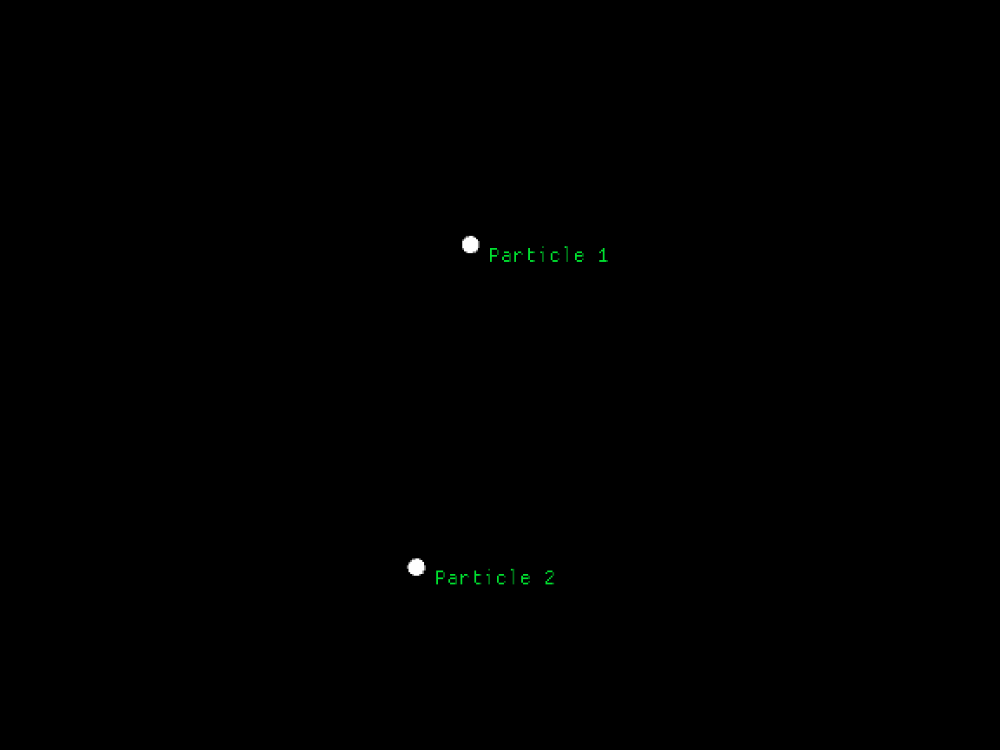

## Particle Gravitation Simulation

This Rust project simulates the force of gravity based on Newton's law of gravitation on particles in space. In the code you can set constants like the gravitational constant, g, and "create" particles.

As an example I have created the Earth and the Moon scaled down. The X and Y axis represent the objects position in a 2D plane and the positions update over time.

Features planned for the future include collisions and more interaction with the program as it is running.

### Dependencies

This project uses the <b><u>macroquad</u></b> library to display the output seen above.
