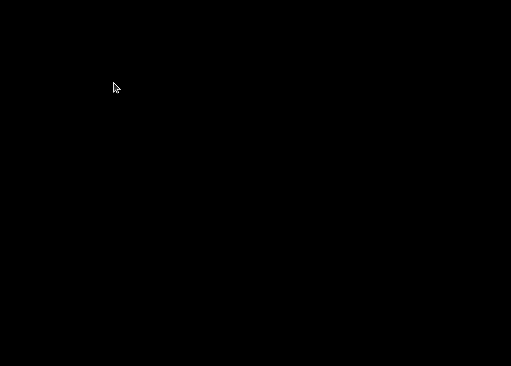
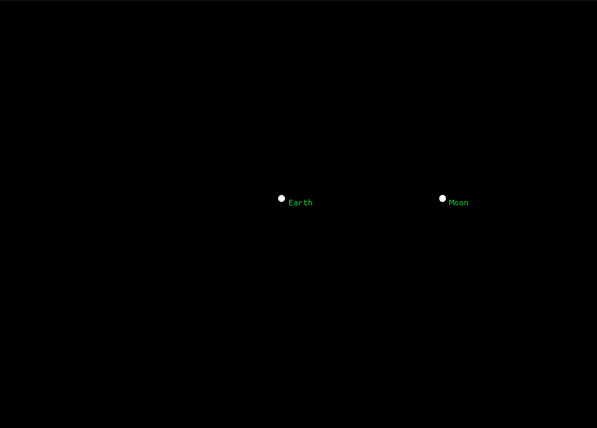

## Particle Gravitation Simulation

Click <a href="https://loganfick.com/projects/particle">here</a> to view it on my website.

This Rust project simulates the force of gravity based on Newton's law of gravitation on particles in space. In the code you can set constants like the gravitational constant, g, and create a system with defined masses, positions, and initial velocities of satelites.

As an example I have created the Earth and the Moon, with their real masses and distances. The X and Y axis represent the objects position in a 2D plane and the positions update over time.




### Installing

Instructions for installing and getting into the simulator

- Clone the repository

- Have Rust installed

- In the directory, run ```cargo build```

- Once built, run the command ```cargo run```, or navigate to the ```target/debug/``` directory in the repository and run the executable from there.

### Usage

The program is interactive, it is simple to navigate the scene, or speed up/down time by doing the following:

- CTRL+(1,2,3...,9) - selects the model, by default 1 is the custom sandbox, 2 is the solar system, and 3 is the earth-moon system

- Space - toggles time on and off

- Left and Right Bracket - zooms out and in to the model space

- SHIFT+(left or right bracket) - decreases and increases the time step, delta_t, as a percentage of the original time step

If the first model is selected, creating a custom particle in the sandbox with a user-defined initial state can be achieved by these keybinds:

- SHIFT+1 - selects mass as the property to edit

- SHIFT+2 - selects initial velocity as the property to edit

- Arrow keys - edits the selected property, a property is selected if it is red

- Holding shift as you edit a property changes the delta to 0.1 from 1.0, for a more fine adjustment

### Dependencies

This project uses the <b><u>macroquad</u></b> library to display the output seen above.
